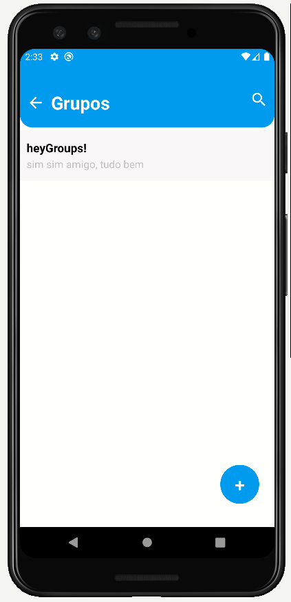

  

 ## heyGroups!

O heyGroups! é uma aplicativo inspirado em um app de chat para interação social, onde você poderá enviar e receber mensagens, além de criar grupos sobre determinado tópico.

# Stack utilizada

- REACT NATIVE
- FIREBASE

# Funcionalidades

- Logar, deslogar e cadastrar usuário.
- Criar e excluir grupos criados.
- Criar até 4 grupos por usuário.
- Pesquisar por algum grupo criado.

# Futuras Features

- Envio de fotos.
- Envio de audios.
- Notificações.
- Configurar plano de fundo.
- Editar perfil de usuário.
- Animações.

# Screenshots

- Tela de Login e Cadastro:

  
  

- Tela Inicial

  

- Tela Criar Grupo

  

- Tela de Chat

  

- Tela Pesquisa

  

# Link para download

(Em breve vou disponibilizar link para download)

# Licença

[MIT](https://choosealicense.com/licenses/mit/)

# Autores

- [@audisiofilho](https://github.com/audisiofilho)
